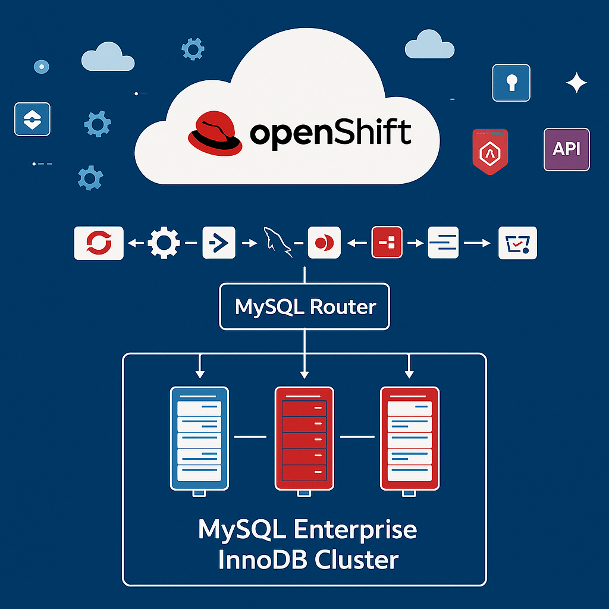
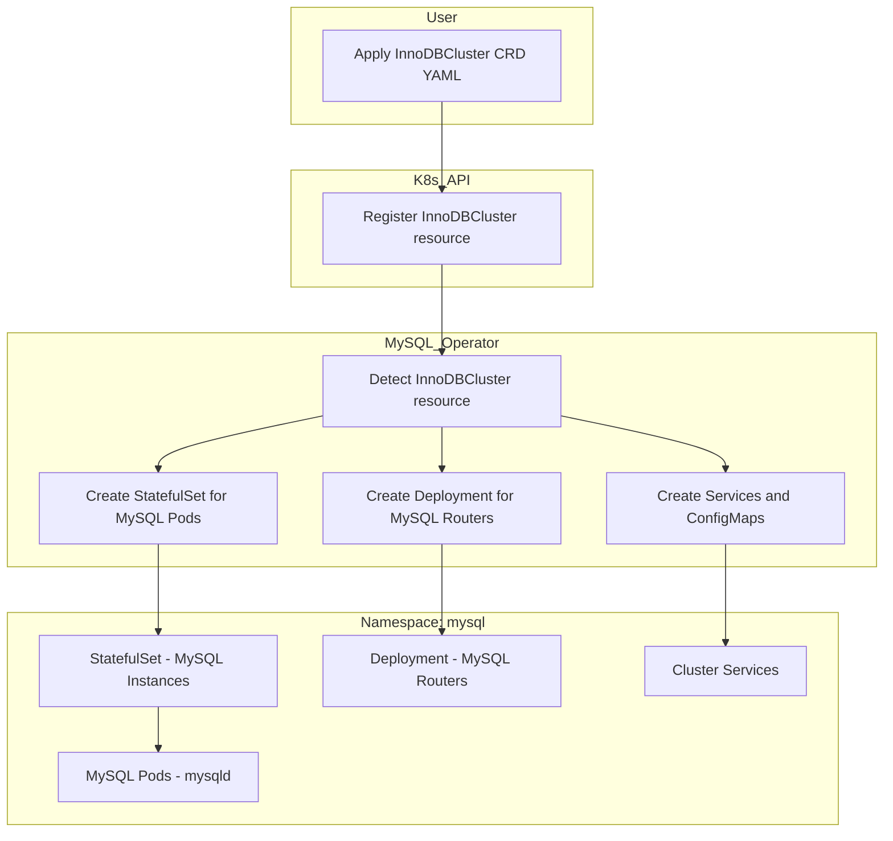

 

## 🚀 Deploy a MySQL EE InnoDB Cluster on OpenShift with MySQL Operator 



## 📘 Introduction

[Red Hat OpenShift Container Platform](https://www.redhat.com/en/technologies/cloud-computing/openshift) is an **enterprise-grade Kubernetes platform** that automates the deployment, scaling, and management of containerized applications across hybrid and multicloud environments.  

It provides built-in features such as:
- Monitoring and logging  
- Automated scaling  
- Integrated CI/CD pipelines  
- Enhanced security and compliance with Security Context Constraints (SCCs)  

OpenShift supports a wide range of programming languages, frameworks, and databases, making it suitable for workloads ranging from **traditional monolithic applications** to **modern cloud-native microservices**.  

This guide demonstrates how to deploy an **Oracle MySQL InnoDB Cluster (Enterprise Edition)** on OpenShift using the **MySQL Operator**.

👉 **Note:** This guide does **not** cover the installation and configuration of OpenShift itself.  
If you want to deploy a local test environment, you can refer to the official [Red Hat CodeReady Containers (CRC)](https://github.com/colussim/crc-openshift/tree/main) project, which provides a minimal OpenShift cluster for development and testing purposes.

---

## 📝 Prerequisites

- Access to an OpenShift 4.x cluster  
- `oc` CLI configured  
- A valid Oracle account to pull images from [Oracle Container Registry](https://container-registry.oracle.com)
  > Note: In this guide, we will pull images directly from the Oracle Container Registry.  
  > However, images could also be hosted in another private registry if preferred.
- Enterprise images available:
  - `mysql/enterprise-operator`
  - `mysql/enterprise-server`
  - `mysql/enterprise-router`

---

## 🔑 Create a named secret containing Oracle Cloud Infrastructure credentials

When you install the application using Kubernetes manifes or Helm, use a Kubernetes secret to provide the authentication details to pull an image from the remote repository.

The Kubernetes Secret contains all the login details you provide if you were manually logging in to the remote Docker registry using the docker login command, including your credentials.

Create a secret by providing the credentials on the command-line by using the following command :

ora-cont-secret.yaml:
```yaml
apiVersion: v1
kind: Secret
metadata:
  name: oracle-registry-secret
type: kubernetes.io/dockerconfigjson
data: 
 .dockerconfigjson:XXXXXXXXXXXXX
```


**dockerconfigjson** corresponds to these JSON entries encoded in base64 :

```json
{
    "auths":{
          "container-registry.oracle.com": {   
        "username":"USERNAME",
        "password":"XXXXXXXX",
        "email":"EMAIL"
         }
        }
}

```

- *container-registry.oracle.com:* Name of Oracle container registry.
- *USERNAME:* User name to access the remote Oracle container registry. The format varies based on your Kubernetes platform.
- *PASSWORD:* Password to access the remote Oracle container registry.
- *EMAIL:* Email ID for your Docker registry.

We will encode the JSON string with the following command:

```bash
:> echo -n '{"auths":{"container-registry.oracle.com":{"username":"xxxx","password":"xxxx","email":"xxx@xxx"}}}' | base64

```

You should get something like:

```bash
eyJhdXRocyI6eyJjb250YWluZXItcmVnaXN0cnkub
```

Use the encoded output in your Secret: Then, insert this encoded code into your secret definition. The YAML file should look like this:

```yaml
apiVersion: v1
kind: Secret
metadata:
  name: oracle-registry-secret
type: kubernetes.io/dockerconfigjson
data: 
 .dockerconfigjson: eyJhdXRocyI6eyJjb250YWluZXItcmVnaXN0cnkub3JhY2xlLmNvbSI6eyJ1c2VybmFtZSI6Im1jb2
```

Create a namespace:
```bash

oc new-project mysql-operator
 
```


Apply the Secret to Kubernetes:
```bash

oc -n mysql-operator apply -f scripts/ora-cont-secret.yaml
   
```

You can also create a secret based on existing credentials. See [Create a Secret based on existing credentials](https://kubernetes.io/docs/tasks/configure-pod-container/pull-image-private-registry/#registry-secret-existing-credentials.) or [Install MySQL Operator for Kubernetes from a Private Registry](https://dev.mysql.com/doc/mysql-operator/en/mysql-operator-private-registeries.html).

> We will also apply this secret in our namespace where our MySQL instances will be deployed. We could also have used an external-secret method to share this secret across different namespaces, or extensions like:
> - <a href="" target="_reflector">reflector</a> with support for auto secret reflection
> - <a href="" target="_replicator">kubernetes-replicator</a> secret replication

---

## 🐬 Installation MySQL Enterprise Operator
There are several methods for deploying the MySQL Operator: through manifest files or via HELM, which is the package manager for Kubernetes. We will use the first method, using manifest files.By default, the manifest deploys the community version of the operator.

---
> If you want to use Helm, please follow the instructions [here](https://dev.mysql.com/doc/mysql-operator/en/mysql-operator-installation-helm.html). For deploying the Enterprise version (which is the case in this document), you need to create a values.yaml file to specify the Enterprise image or modify the deploy-operator.yaml file to set the correct image, in the section: 

```yaml
containers:
  - name: mysql-operator
    image: community-operator or enterprise-operator
```

and configure your Docker registry (or Oracle's one).Here is an example using the Oracle registry, referencing the secret we previously created :

```yaml
containers:
   - name: mysql-operator
     image: container-registry.oracle.com/mysql/enterprise-operator:latest
....
imagePullSecrets:
        - name: oracle-registry-secret
```

>
> An example of the values.yaml :
```yaml
image:
  registry: container-registry.oracle.com
  repository: mysql
  name: enterprise-operator  # Use 'enterprise-operator' for enterprise image
  pullPolicy: IfNotPresent
  tag: "latest" 
  pullSecrets:
    enabled: true
    secretName: oracle-registry-secret  # Replace with the name of your secret

```
> **Add the Helm repository:** 
>
> helm repo add mysql-operator https://mysql.github.io/mysql-operator/
> helm repo update
>
> **Install MySQL Operator for Kubernetes :**
>
> helm install my-mysql-operator mysql-operator/mysql-operator --namespace mysql-operator -f values.yaml
>
---
**⚠️ Known Issue: Cluster Domain Detection**

There is a known issue with the Oracle MySQL Operator where it often fails to detect the Kubernetes cluster domain automatically.

If you encounter an error like Failed to detect cluster domain, you need to explicitly specify the domain in the operator deployment.


Edit the deploy-operator.yaml file and add the following environment variable under the env: section of the Deployment:

```yaml
- name: MYSQL_OPERATOR_K8S_CLUSTER_DOMAIN
  value: "your_cluster_domain"

```

If you’re deploying the operator using Helm, you can set the cluster domain via the following parameter:

```yaml

--set env.MYSQL_OPERATOR_K8S_CLUSTER_DOMAIN=your_cluster_domain

```

---

By default, some manifests may include:
```yaml
securityContext:
  runAsUser: 2
```

The value 2 refers to the mysql user inside the container image (UID 2 in /etc/passwd).
On OpenShift, pods are not allowed to run with a fixed UID that falls outside the UID range assigned to the namespace (e.g., 1000670000–1000679999).
OpenShift automatically assigns a valid UID to each pod/service account.

If you keep runAsUser: 2, the pod will fail with an error similar to:
```bash
must be in the ranges: [1000670000, 1000679999]
```


---

First deploy the Custom Resource Definition (CRDs):

```mermaid
flowchart TD
  subgraph User
    U1[Run: kubectl apply -f deploy-crds.yaml]
    U2[Run: kubectl apply -f deploy-operator.yaml]
  end

  subgraph K8s_API
    CRD_Def[Create CustomResourceDefinitions]
    Operator_Deploy[Deploy Operator + RBAC]
  end

  subgraph Namespace[NS: mysql-operator]
    Deployment[Deployment: mysql-operator]
    Pods[Pod - mysql-operator]
  end

  U1 --> CRD_Def
  U2 --> Operator_Deploy

  CRD_Def --> K8s_API
  Operator_Deploy --> K8s_API

  K8s_API --> Deployment
  Deployment --> Pods
  ```

```bash

oc -n mysql-operator apply -f https://raw.githubusercontent.com/mysql/mysql-operator/9.4.0-2.2.5//deploy/deploy-crds.yaml
 
```

Verify CRDs deployment :
```bash
:> oc get crds|grep innodb
NAME                                    CREATED AT
innodbclusters.mysql.oracle.com      2025-08-20T06:29:10Z
:>
```

Then deploy MySQL Operator for Kubernetes:
```bash

oc -n mysql-operator apply -f scripts/deploy-operator.yaml
 
```

By default, the deployment creates a namespace called **mysql-operator** and deploys the operator in this namespace.

Verify a deploiement :
```bash
oc get deployment -n mysql-operator mysql-operator

```

The result of the command should look like this :
```bash
NAME             READY   UP-TO-DATE   AVAILABLE   AGE
mysql-operator   1/1     1            1           54s

```

Now that our operator is deployed, we will be able to deploy our InnoDB cluster.

---


## 🐬 MySQL Enterprise Innodb cluster Deployment




✅ **Step1:** Create a Project for the Cluster

```bash

oc new-project mysql-demo
 
```

✅ **Step2:** Create the MySQL secret and Apply Oracle Container Registry secret: :


```bash

oc -n mysql-demo create secret generic mysql-secret \
  --from-literal=rootUser=root \
  --from-literal=rootHost=% \
  --from-literal=rootPassword=YourMySQLUserPassword
 
```

❗️ Replace the value of MYSQL_PASSWORD with your root user’s password

The password is used by management scripts and commands for MySQL InnoDB Cluster and ClusterSet deployment in this tutorial.


Apply Oracle Container Registry secret:

```bash

oc -n mysql-demo apply -f scripts/ora-cont-secret.yaml
   
```

✅ **Step3:** Create Service Accounts and Assign SCCs

MySQL InnoDB Cluster requires two service accounts:
```bash

# For MySQL instances
oc -n mysql-demo create sa mysql-ic-sa
oc adm policy add-scc-to-user privileged -z mysql-ic-sa -n mysql-demo

# For MySQL Router
oc -n mysql-demo create sa mysql-demo-sidecar-sa
oc adm policy add-scc-to-user anyuid -z mysql-demo-sidecar-sa -n mysql-demo 
```

✅ **Step 4** Create RoleBinding for Operator Access

```bash
oc -n mysql-demo create rolebinding mysql-operator-edit \
  --clusterrole=edit \
  --serviceaccount=mysql-operator:mysql-operator-sa
```
This allows the operator to manage resources inside the mysql-demo namespace.


✅ **Step 5** Create RBAC for the MySQL ServiceAccount

In addition to SCCs, the mysql-ic-sa service account requires RBAC permissions to manage Pods, update their status, create events, and interact with InnoDBCluster resources.

Create the following Role and RoleBinding:
```yaml
apiVersion: rbac.authorization.k8s.io/v1
kind: Role
metadata:
  name: mysql-ic-rbac
  namespace: mysql-demo
rules:
  - apiGroups: [""]
    resources: ["pods"]
    verbs: ["get","list","watch","update","patch"]
  - apiGroups: [""]
    resources: ["pods/status"]        
    verbs: ["update","patch"]
  - apiGroups: [""]
    resources: ["events"]
    verbs: ["create","patch","update"]
  - apiGroups: [""]
    resources: ["secrets","configmaps"]
    verbs: ["get","list","watch"]
  - apiGroups: ["mysql.oracle.com"]
    resources: ["innodbclusters","innodbclusters/status"]
    verbs: ["get","list","watch"]
---
apiVersion: rbac.authorization.k8s.io/v1
kind: RoleBinding
metadata:
  name: mysql-ic-rbac-binding
  namespace: mysql-demo
subjects:
  - kind: ServiceAccount
    name: mysql-ic-sa
    namespace: mysql-demo
roleRef:
  apiGroup: rbac.authorization.k8s.io
  kind: Role
  name: mysql-ic-rbac


```

Apply this manifest :
```bash
oc -n mysql-demo apply -f script/Create_Role_RoleBinding.yaml
```


✅ **Step 6** Get the Namespace fsGroup

Retrieve the UID range used by OpenShift for this namespace:

```bash
oc get ns mysql-demo -o jsonpath='{.metadata.annotations.openshift\.io/sa\.scc\.uid-range}' | cut -d/ -f1
```
You will use this value in your InnoDBCluster manifest as the fsGroup.

✅ **Step 7** — Create the InnoDBCluster Deployment

Create a manifest file innodbcluster.yaml:
```yaml
apiVersion: mysql.oracle.com/v2
kind: InnoDBCluster
metadata:
  name: mysql-demo
  namespace: mysql-demo
spec:
  secretName: mysql-secret
  instances: 3
  version: "9.4.0"

  router:
    instances: 2
    version: "9.4.0"
    podSpec:
      serviceAccountName: mysql-demo-sidecar-sa
      imagePullSecrets:
        - name: oracle-registry-secret
      securityContext:
        runAsNonRoot: true
        fsGroup: 1000670000
        seccompProfile: { type: RuntimeDefault }

  tlsUseSelfSigned: true

  datadirPermissions:
    setRightsUsingInitContainer: true

  datadirVolumeClaimTemplate:
    accessModes: ["ReadWriteOnce"]
    resources:
      requests:
        storage: 5Gi

  podSpec:
    serviceAccountName: mysql-ic-sa
    imagePullSecrets:
      - name: oracle-registry-secret
    securityContext:
      runAsNonRoot: true
      fsGroup: 1000670000
      fsGroupChangePolicy: OnRootMismatch
      seccompProfile: { type: RuntimeDefault }

```


Then deploy MySQL InnoDB Cluster :
```bash

oc -n mysql-demo apply -f scripts/innodbcluster.yaml
```

We can monitor the deployment of our cluster with the following command :
```bash

oc get innodbcluster --watch -n mysql-demo    
NAME          STATUS   ONLINE   INSTANCES   ROUTERS   AGE
dbcluster01   PENDING   0        3           3         18s
 
```

After a few minutes, our cluster is operational :
```bash

oc get innodbcluster --watch -n mysql-demo   
NAME          STATUS   ONLINE   INSTANCES   ROUTERS   AGE
mysql-demo    ONLINE   3        3           3         4m


 
```

We can check the status of the pods in our namespace:
```bash

oc get pods -n mysql-demo

NAME                                  READY   STATUS    RESTARTS      AGE
mysql-demo-0                         2/2     Running   6 (18m ago)   28m
mysql-demo-1                         2/2     Running   0             12m
mysql-demo-2                         2/2     Running   6 (18m ago)   28m
mysql-demo-router-77ff89bf79-bb7nt   1/1     Running   0             13m
mysql-demo-router-77ff89bf79-g6lks   1/1     Running   0             13m
mysql-demo-router-77ff89bf79-vlb96   1/1     Running   0             13m

 
```
We can see that we have our 3 database instance pods and the 2 router pods running properly.

We will connect directly to the pod of the first instance (dbcluster01-0) and execute the various commands.

Connect to the pod of the first instance (dbcluster01-0) :

```bash

oc -n mysql-demo exec -it mysql-demo-0 -c mysql -- /bin/bash

 
```

Connect to the first MySQL instance:
```bash

mysqlsh --uri root@mysql-demo-0 -p --js
Cannot set LC_ALL to locale en_US.UTF-8: No such file or directory
Please provide the password for 'root@mysql-demo-0': ********
MySQL Shell 9.4.0-commercial

Copyright (c) 2016, 2025, Oracle and/or its affiliates.
Oracle is a registered trademark of Oracle Corporation and/or its affiliates.
Other names may be trademarks of their respective owners.

Type '\help' or '\?' for help; '\quit' to exit.
Creating a session to 'root@mysql-demo-0'
Fetching schema names for auto-completion... Press ^C to stop.
Your MySQL connection id is 2942
Server version: 9.4.0-commercial MySQL Enterprise Server - Commercial
No default schema selected; type \use <schema> to set one.
 MySQL  mysql-demo-0:3306 ssl  JS > 

```

Verify the cluster's status:
```
MySQL  mysql-demo-0:3306 ssl  JS > var cluster = dba.getCluster();
MySQL  mysql-demo-0:3306 ssl  JS > cluster.status();

 ```

This command shows the status of the cluster. The topology consists of three hosts, one primary and two secondary instances. Optionally, you can call cluster.status({extended:1}).

```json
"clusterName": "mysql_demo", 
    "clusterRole": "PRIMARY", 
    "defaultReplicaSet": {
        "name": "default", 
        "primary": "mysql-demo-0.mysql-demo-instances.mysql-demo.svc.cluster.local:3306", 
        "ssl": "REQUIRED", 
        "status": "OK", 
        "statusText": "Cluster is ONLINE and can tolerate up to ONE failure.", 
        "topology": {
            "mysql-demo-0.mysql-demo-instances.mysql-demo.svc.cluster.local:3306": {
                "address": "mysql-demo-0.mysql-demo-instances.mysql-demo.svc.cluster.local:3306", 
                "memberRole": "PRIMARY", 
                "mode": "R/W", 
                "readReplicas": {}, 
                "role": "HA", 
                "status": "ONLINE", 
                "version": "9.4.0"
            }, 
            "mysql-demo-1.mysql-demo-instances.mysql-demo.svc.cluster.local:3306": {
                "address": "mysql-demo-1.mysql-demo-instances.mysql-demo.svc.cluster.local:3306", 
                "memberRole": "SECONDARY", 
                "mode": "R/O", 
                "readReplicas": {}, 
                "replicationLagFromImmediateSource": "", 
                "replicationLagFromOriginalSource": "", 
                "role": "HA", 
                "status": "ONLINE", 
                "version": "9.4.0"
            }, 
            "mysql-demo-2.mysql-demo-instances.mysql-demo.svc.cluster.local:3306": {
                "address": "mysql-demo-2.mysql-demo-instances.mysql-demo.svc.cluster.local:3306", 
                "memberRole": "SECONDARY", 
                "mode": "R/O", 
                "readReplicas": {}, 
                "replicationLagFromImmediateSource": "", 
                "replicationLagFromOriginalSource": "", 
                "role": "HA", 
                "status": "ONLINE", 
                "version": "9.4.0"
            }
        }, 
        "topologyMode": "Single-Primary"
    }, 
    "domainName": "mysql_demo", 
    "groupInformationSourceMember": "mysql-demo-0.mysql-demo-instances.mysql-demo.svc.cluster.local:3306"
}
```

---

## 🎉 Conclusion
By following this guide, we successfully deployed a **MySQL InnoDB Cluster Enterprise Edition** on **Red Hat OpenShift** using the MySQL Operator.  
The deployment includes a highly available InnoDB Cluster with multiple MySQL instances and MySQL Router replicas, secured with OpenShift RBAC and SCC configurations.

This setup demonstrates how Oracle MySQL can be integrated into an enterprise Kubernetes platform such as OpenShift, providing:

- **High availability** with InnoDB Cluster  
- **Scalability** through Kubernetes orchestration  
- **Security** via OpenShift ServiceAccounts, SCCs, and RBAC  
- **Flexibility** with enterprise images from Oracle Container Registry  

For production environments, consider:  
- Configuring **persistent storage classes** adapted to your infrastructure  
- Enabling **TLS certificates** (custom CA instead of self-signed)  
- Integrating with **monitoring tools** such as Prometheus/Grafana  
- Automating CI/CD pipelines for database updates  

---

## ⏭️  Next step

Your MySQL InnoDB cluster is operational. You can now deploy an application either outside the Kubernetes cluster or within it.
If you want to deploy a simple application, [here](https://github.com/colussim/demo-ecommerce) is an example.
We could also explore the MySQLBackup resource of the Operator,this will likely be covered in a future article.

